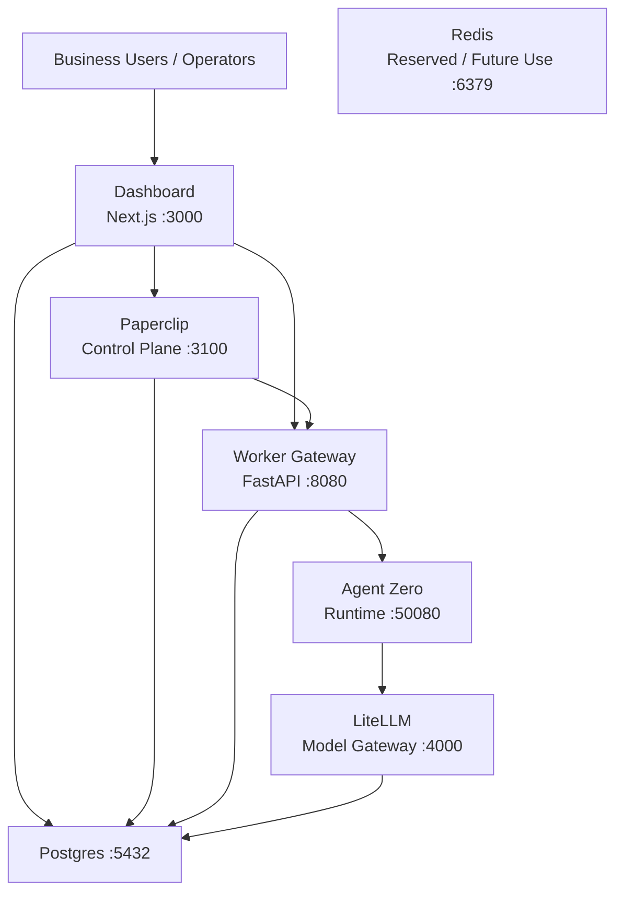

# Habilis — Psilodigital Worker Platform

A multi-tenant worker operating system for small and medium businesses. Businesses can activate AI workers for real operational jobs — inbox management, content creation, booking operations, CRM follow-up, and admin support.

Built as a modular Docker Compose stack: Dashboard (product surface), Paperclip (orchestration), worker-gateway (execution boundary), Agent Zero (worker runtime), LiteLLM (model gateway), plus Postgres and a provisioned Redis instance reserved for future coordination/caching. Target deployment: Hetzner via Coolify.

## Open Source Readiness

This repository includes the standard baseline expected from an open source
project:

- [`CONTRIBUTING.md`](CONTRIBUTING.md) for local setup, validation, and PR expectations
- [`CODE_OF_CONDUCT.md`](CODE_OF_CONDUCT.md) for community behavior standards
- [`SECURITY.md`](SECURITY.md) for private vulnerability reporting
- [`SUPPORT.md`](SUPPORT.md) for help and issue-routing guidance
- [`GOVERNANCE.md`](GOVERNANCE.md) for the current maintainer-led decision model
- [`THIRD_PARTY_NOTICES.md`](THIRD_PARTY_NOTICES.md) for upstream attribution and external provider terms
- GitHub issue forms, a pull request template, `CODEOWNERS`, CI, and Dependabot

## Architecture

This is the quick-start view of the running stack. The fuller layered diagram lives in [`docs/architecture/system-architecture.md`](docs/architecture/system-architecture.md).



All services communicate over the `workerstack` Docker bridge network. Container names follow the `psilo-*` convention.

## Prerequisites

- **Docker** and **Docker Compose** (v2) — [install](https://docs.docker.com/get-docker/)
- **At least one LLM provider API key** (OpenAI, Anthropic, Google, or Groq) for LiteLLM to route model requests
- ~4 GB free RAM for all seven containers

## Quick Start

```sh
# 1. Generate .env with random secrets
make setup

# 2. Add at least one provider key
#    Edit .env and fill in OPENAI_API_KEY, ANTHROPIC_API_KEY, etc.

# 3. Build and start all services
make build

# 4. Verify everything is healthy
make status

# 5. Run smoke tests
make test
```

## Service URLs (local)

| Service | URL | Notes |
|---------|-----|-------|
| Dashboard | http://localhost:3000 | Customer-facing product surface |
| Paperclip | http://localhost:3100 | Control plane UI |
| LiteLLM | http://localhost:4000 | Model gateway (auth required) |
| Agent Zero | http://localhost:50080 | Worker runtime UI |
| Worker Gateway | http://localhost:8080 | Bridge API |
| Worker Gateway Health | http://localhost:8080/healthz | Health + downstream status |

Postgres (`:5432`) and Redis (`:6379`) are internal-only — not exposed to the host.

## Make Targets

```
make setup      Generate .env from .env.example with random secrets
make validate   Validate docker-compose.yml
make build      Build and start the stack (detached)
make up         Start the stack (detached, no rebuild)
make down       Stop the stack
make clean      Stop the stack and remove volumes
make logs       Tail logs for all services
make status     Show service status
make test       Run smoke tests against running stack
```

Per-service shortcuts: `make logs-worker-gateway`, `make restart-paperclip`, `make shell-agentzero`, etc.

## Environment Variables

Run `make setup` to auto-generate secrets. The setup script fills:

| Variable | Generated | Notes |
|----------|-----------|-------|
| `POSTGRES_PASSWORD` | Yes | 32-char random |
| `LITELLM_MASTER_KEY` | Yes | `sk-` prefix + 48-char random |
| `PAPERCLIP_AGENT_JWT_SECRET` | Yes | 64-char hex |
| `AGENTZERO_AUTH_PASSWORD` | Yes | 32-char random |

You must still set manually:

| Variable | Where |
|----------|-------|
| `OPENAI_API_KEY` / `ANTHROPIC_API_KEY` / etc. | At least one provider key in `.env` |
| `AGENTZERO_API_TOKEN` | From Agent Zero UI after first boot (see below) |

See `.env.example` for the full list.

## Post-Boot Setup

### 1. Get the Agent Zero API token

After the stack is running:

1. Open http://localhost:50080
2. Log in with the credentials from `.env` (`AGENTZERO_AUTH_LOGIN` / `AGENTZERO_AUTH_PASSWORD`)
3. Go to **Settings > External Services**
4. Copy the API token
5. Paste it into `.env` as `AGENTZERO_API_TOKEN=<token>`
6. Restart the gateway: `make restart-worker-gateway`

### 2. Configure Agent Zero's model provider

In the Agent Zero UI, set the chat model to use LiteLLM as an OpenAI-compatible gateway:

- Provider: **OpenAI Compatible**
- Base URL: `http://litellm:4000`
- API Key: your `LITELLM_MASTER_KEY` value
- Model: one of the models in `services/litellm/config.yaml` (e.g. `gpt-4.1-mini`)

### 3. Configure Paperclip HTTP adapter

1. Open http://localhost:3100
2. Create an agent with adapter type **HTTP**
3. Set the webhook URL to:
   ```
   http://worker-gateway:8080/paperclip/wake
   ```
4. Send a test task — check worker-gateway logs with `make logs-worker-gateway`

## How the Bridge Works

1. Paperclip POSTs a wake event to `worker-gateway` at `/paperclip/wake`
2. The gateway executes the wake through the runtime adapter
3. The runtime adapter sends the task to Agent Zero via `POST /api_message`
4. Agent Zero routes model traffic through LiteLLM
5. The gateway returns a 2xx response to Paperclip; the current HTTP adapter flow does not require a callback endpoint

If Agent Zero is unreachable or the API token is missing, the gateway returns an error result through the same wake request flow.

## Project Structure

```
habilis/
├── apps/
│   ├── dashboard/                  Next.js customer product surface
│   └── worker-gateway/             FastAPI bridge service
│       ├── app.py
│       ├── Dockerfile
│       └── requirements.txt
├── packages/
│   ├── shared-types/               Cross-service type definitions
│   ├── worker-definitions/         Worker configs and schemas
│   ├── connector-sdk/              Connector SDK
│   ├── ui/                         Shared UI components
│   └── config/                     Shared configuration
├── services/
│   ├── paperclip/                  Control plane (Dockerfile)
│   ├── litellm/                    Model gateway (config.yaml)
│   └── agentzero/                  Worker runtime (placeholder)
├── infra/
│   ├── postgres/init/              DB init scripts
│   ├── docker/                     Docker configs
│   ├── coolify/                    Deployment configs
│   ├── scripts/                    setup.sh, smoke-test.sh
│   └── env/                        Environment templates
├── docs/
│   └── mission.md                  Mission and architecture vision
├── docker-compose.yml              Full stack definition
├── .env.example                    Environment variable template
├── Makefile                        Dev workflow shortcuts
└── CLAUDE.md                       AI assistant guidance
```

## Coolify Deployment

Use the **Docker Compose build pack** in Coolify and point it to this repo.

**Public-facing services** (attach domains):
- `app.yourdomain.com` → Dashboard, port 3000
- `paperclip.yourdomain.com` → Paperclip, port 3100
- `llm.yourdomain.com` → LiteLLM, port 4000

**Internal-only** (no public domain):
- Postgres, Redis, Agent Zero, Worker Gateway

**Required env vars in Coolify**: same as `.env.example` — set all secrets in Coolify's environment variable UI rather than committing a `.env` file.

**Recommendations**:
- Pin `LITELLM_IMAGE_TAG` to a specific stable version after testing
- After Paperclip starts, shell in and run `paperclipai configure --section server` to harden the instance for internet-facing deployment

## Contributing

Contributions are welcome. Start with [`CONTRIBUTING.md`](CONTRIBUTING.md),
then open an issue or pull request with clear scope and testing notes.

## License

Apache-2.0. See [`LICENSE`](LICENSE).
