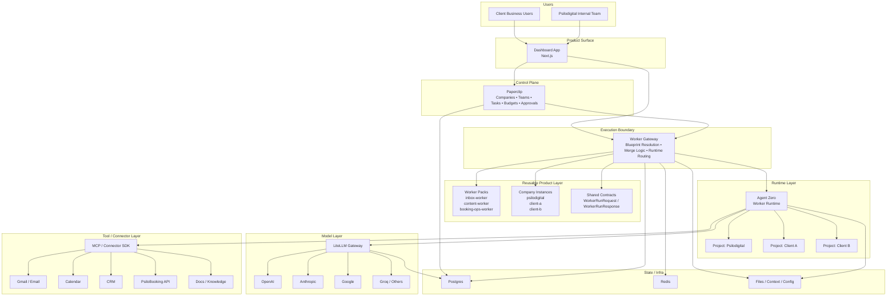
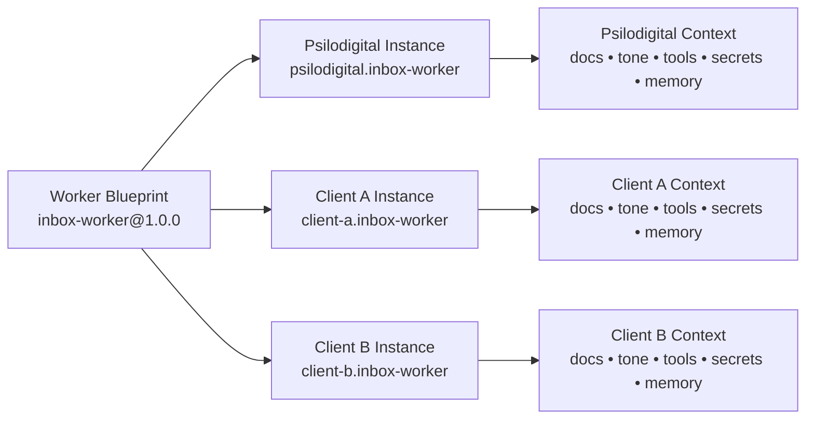
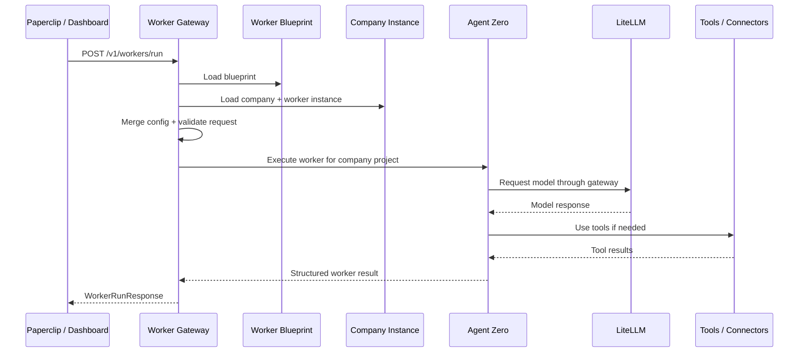
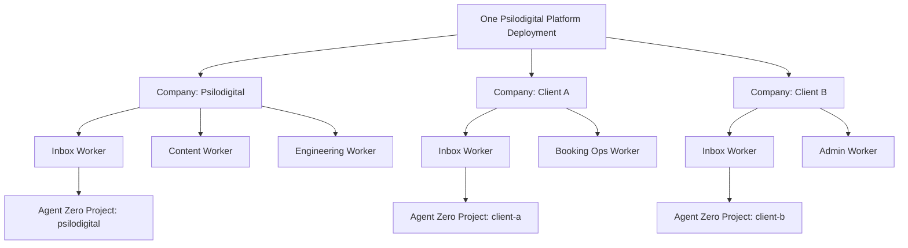

# System architecture (Mermaid)

Layered view of the Psilodigital Worker Platform: product surface, control plane, execution boundary, reusable worker definitions, runtime, models, tools, and shared infrastructure.

The same diagrams are stored as standalone Mermaid sources under [`mermaid/`](mermaid/) (`.mermaid` files) for editors, [Mermaid Live Editor](https://mermaid.live), and the Mermaid CLI (`mmdc`). Keep those files in sync when you change the fenced blocks below.

Related: [Mission & mental model](../mission.md#architecture), [v1 thin slice](v1-thin-slice.md).

---

## System architecture

**Source:** [mermaid/system-architecture.mermaid](mermaid/system-architecture.mermaid)

Users interact with the Dashboard; Paperclip orchestrates work; the Worker Gateway resolves blueprints and routes execution to Agent Zero; LiteLLM fronts model providers; MCP and connectors reach external systems; Postgres, Redis, and files hold state and context.



---

## Blueprint → company instance model

**Source:** [mermaid/blueprint-company-instance.mermaid](mermaid/blueprint-company-instance.mermaid)

One **worker blueprint** (versioned pack, e.g. `inbox-worker@1.0.0`) is instantiated per company. Each instance gets its own **context**: documentation, tone, tool allowlists, secrets, and memory — without copying the whole pack for every tenant.



---

## Request flow

**Source:** [mermaid/request-flow.mermaid](mermaid/request-flow.mermaid)

End-to-end path for blueprint-driven execution: load blueprint and company instance, merge and validate, run in Agent Zero against the correct project, model via LiteLLM, tools as needed, return a structured `WorkerRunResponse`.

The Worker Gateway also exposes `POST /paperclip/wake` for legacy Paperclip wake events; new integrations should prefer `POST /v1/workers/run`.



---

## Internal company / client tenancy model

**Source:** [mermaid/tenancy-model.mermaid](mermaid/tenancy-model.mermaid)

A single platform deployment hosts multiple **companies**. Each company enables a subset of **workers**; each worker maps to an **Agent Zero project** so runs, secrets, and context stay isolated per tenant.



---

## Shortest path summary

```
Dashboard / Paperclip
        ↓
   Worker Gateway
        ↓
Blueprint + Company Instance Resolution
        ↓
     Agent Zero
        ↓
      LiteLLM
        ↓
  Model Providers + Tools
```

---

## Rendering these diagrams

- **GitHub / GitLab**: Mermaid is rendered in Markdown by default on many hosts.
- **Local preview**: VS Code with a Mermaid preview extension, or paste into [mermaid.live](https://mermaid.live).
- **Standalone files**: Open any `mermaid/*.mermaid` file in an editor that supports Mermaid, or run the [Mermaid CLI](https://github.com/mermaid-js/mermaid-cli) against a file, for example:  
  `npx -y @mermaid-js/mermaid-cli -i docs/architecture/mermaid/system-architecture.mermaid -o system-architecture.svg`
